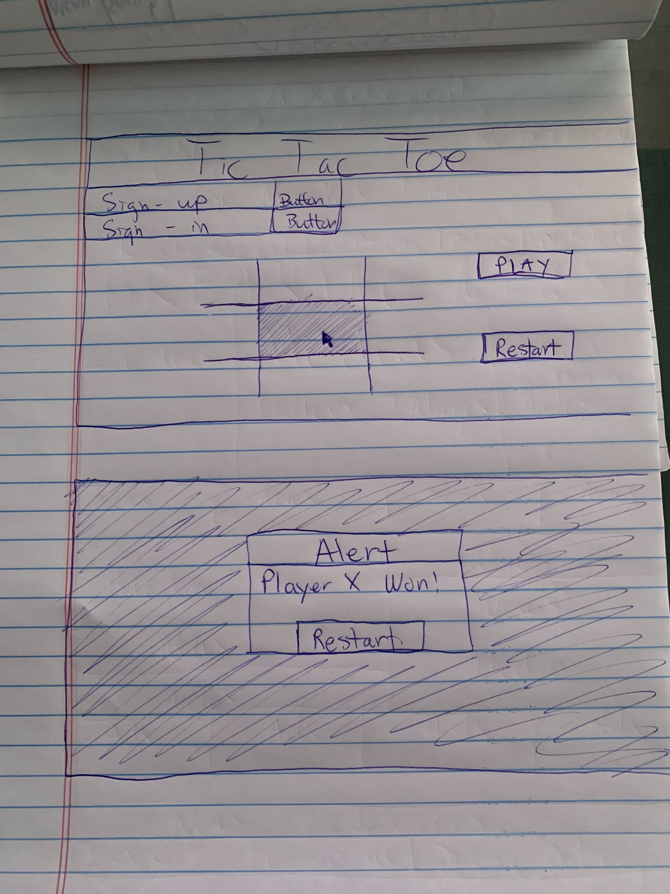

# Tic-Tac Toes: A duel between Tic-Tac and Toes

This application allows the user to sign up, sign in, and sign out on a server. A signed in user/player can play a the game of Tic-Tac-Toes. To stop playing the user can sign out. I want to make a simple Tic-Tac-Toe game with just a little twist to the title and the theme and making it Tic-Tac vs Toes. 

## Important Links

- [Tic-Tac Vs Toes](https://hieppie.github.io/tictactoe-client/)
- [Tic-Tac-Toe Rules](https://www.wikihow.com/Play-Tic-Tac-Toe)

## Planning

### User Stories
- As a new user I want to be able to sign up for an account and be notified if the sign up is a success or failure
- As a returning user I want to be able to sign in and be notified if the sign in is a success or failure
- As a signed in user I want to be able to see the game board and to click Start Game to play. Tic-Tac always go first followed by Toes. 
- As a user I want to be able to click on the box on the game board and occupy the box with the either Tic-Tac or Toes
- As a user I want to be unable to change the character on the box once it is occupied
- As a user I want to be notified if I won after one of the winning condition is met and which character won.
- As a user I want to be able to restart a game with a new cleared game board
- As a user I want to be able to sign out and be notified if the sign out is a success.

## Wireframe

## Reference

  - Images
    - [tic-tac hero](https://media0.giphy.com/media/dLvb1XJ4e9OVB6uWJy/giphy.gif?cid=ecf05e47kcbjalc05axl16ghfoo1rt4knhzo5eavysufp3kk&rid=giphy.gif&ct=g)
    - [green tic-tac](https://media3.giphy.com/media/hvRhoBF5xVDvrmZCRp/giphy.gif?cid=790b7611fed8f87094e8b1986757547dd526bdfbd30564c6&rid=giphy.gif&ct=s)
    - [toes1](https://media0.giphy.com/media/loHIRKRjn6Nu2Xixbw/giphy.gif?cid=ecf05e47usey6qd0l32rptbf09u2f55anm9nwxkcslg2zis2&rid=giphy.gif&ct=g)
    - [toes2](https://media1.giphy.com/media/AGFvTmdx8Jfm4UOPtx/giphy.gif?cid=ecf05e47u4csofn82s9vd9vmzmi35ly9eehl28g7jb5twdtp&rid=giphy.gif&ct=g)

  - Font
    - [Pres Start 2P Google Font](https://fonts.google.com/specimen/Press+Start+2P)

  - Videos
    - [Creating TictacToe Game](https://www.youtube.com/watch?v=x1B9IVrDIxg)

  - Specials Thanks
    - My instructors
    - My cohorts who helped me especially Maura and Moe
